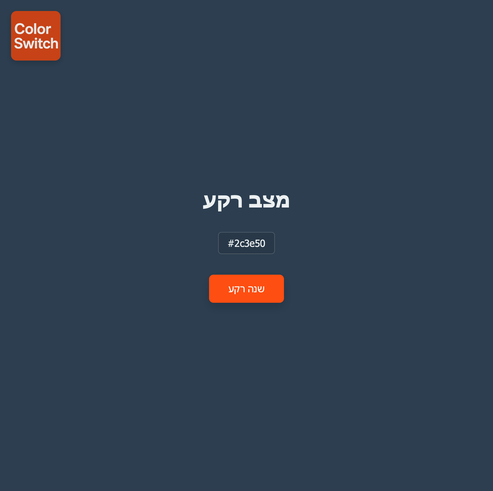

# DOM Color Toggle Pro

A clean and elegant web app that toggles between **Light** and **Dark** themes using HTML, CSS, and JavaScript.  
Built as part of a DOM challenge, but polished for real-world presentation.

---

### 🎯 Features

- 🌓 **Light & Dark Mode Switching**
- 🎨 Smooth background + text color transitions
- 💾 Remembers your theme using `localStorage`
- 🖼️ Dynamic logo switching based on theme
- 📱 Responsive layout (logo adapts to screen size)
- 🚀 Animated element entrance for polished feel

---

### 🛠️ Built With

- **HTML5** – semantic structure  
- **CSS3** – transitions, media queries, animations  
- **Vanilla JavaScript** – DOM manipulation, theme persistence  

---

### 📸 Preview

---

### 🧠 How It Works

- On page load, the app checks `localStorage` for your saved theme.
- Theme colors + logo are updated via a single `applyTheme()` function.
- Click the **"שנה רקע"** button to toggle background color and experience smooth transitions.

---

### 📂 Files

📁 dom-color-toggle-pro/
├── index.html
├── style.css
├── script.js
├── logo-light.png
├── logo-dark.png
├── favicon.ico
└── preview.png

---

### 📣 Author Notes

This project was designed as a DOM exercise, but elevated into a clean, interactive, and responsive mini-app.  
It's ideal for beginner portfolios or learning DOM-based interactivity in a refined, real-world UI.

---

### 🧪 Want to Try It?

Open `index.html` directly, or [View Demo on GitHub Pages](https://penace.github.io/dom-color-toggle/) *(after deployment)*

---
